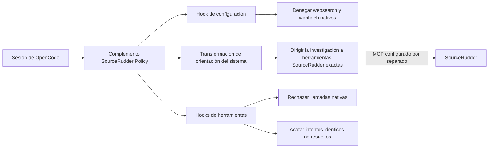

<p align="center">
  
</p>

<p align="center"><strong>Mantenga la investigación de OpenCode en la ruta gobernada de SourceRudder sin reemplazar la configuración del host.</strong></p>

[English](README.md) | [Español](README.es.md)

<p align="center">
  <a href="https://github.com/mdesantis1984/SourceRudder-OpenCode-Policy/actions/workflows/ci.yml"></a>
  
  
  
  <a href="LICENSE"></a>
</p>

<p align="center">
  <a href="#quick-start">Instalar la política</a> ·
  <a href="#policy-boundary">Examinar el límite</a> ·
  <a href="#runtime-flow">Ver el flujo de ejecución</a> ·
  <a href="RUNBOOK.es.md">Operar y revertir</a> ·
  <a href="SECURITY.es.md">Informar de forma segura</a>
</p>

SourceRudder Policy es un complemento para OpenCode, seguro ante actualizaciones, que exige
investigación con SourceRudder primero y bloquea estrictamente las herramientas
nativas `websearch` y `webfetch` de OpenCode. Está dirigido a operadores de
OpenCode que necesitan un límite de política local, pequeño y auditable.

> **Estado:** implementado y verificable localmente. Este proyecto complementario
> no es un fork, una versión publicada ni una publicación de SourceRudder.
> La visibilidad pública está aprobada y se sigue en el [issue #4](https://github.com/mdesantis1984/SourceRudder-OpenCode-Policy/issues/4), pendiente de su puerta de publicación.
> El badge de CI apunta a `main` y solo será evidencia pública anónima después de completar esa puerta.

## Por qué esta política

| Qué necesitan los operadores | Qué proporciona este complemento |
| --- | --- |
| Una ruta de investigación predecible | La orientación SourceRudder-first indica la herramienta exacta para cada fuente de evidencia compatible. |
| Un límite estricto para herramientas nativas | Los permisos combinados deniegan `websearch` y `webfetch`; el hook previo también rechaza llamadas directas. |
| Convivencia segura con OpenCode | Los permisos no relacionados y el texto del sistema del host se conservan durante la instalación y actualización de la política. |
| Comportamiento revisable | Una superficie TypeScript pequeña, un conjunto exacto de nombres de herramientas supervisadas, estado de intentos acotado y pruebas de Node exponen el contrato. |

## Relación con SourceRudder

Este complemento se integra con la puerta de enlace pública de investigación MCP
de [SourceRudder](https://github.com/mdesantis1984/SourceRudder). No incluye,
configura, publica ni opera ese proyecto ascendente. Solo añade orientación de
políticas locales de OpenCode y comprobaciones en tiempo de ejecución para las
herramientas de investigación nativas.

<a id="runtime-flow"></a>

## Cómo funciona



El complemento gobierna OpenCode en memoria. No actúa como proxy de investigación,
no inicia SourceRudder ni modifica la conexión MCP configurada por separado.

<a id="quick-start"></a>

## Inicio rápido

1. El entorno de ejecución del complemento declara Node.js 20 o posterior. El
   desarrollo local y la CI requieren una versión de Node aceptada por el grafo
   bloqueado de dependencias de desarrollo; la CI usa Node.js 24. Node.js 20 no
   se prueba actualmente.
2. Instale las dependencias bloqueadas y ejecute la comprobación local completa:

   ```sh
   npm ci --ignore-scripts
   npm run check
   npm run check:docs
   ```

3. Compile el paquete versionado del complemento:

   ```sh
   npm run build
   ```

4. Copie `dist/sourcerudder-policy-v1.0.0.js` en la raíz del directorio de
   complementos de OpenCode y reinicie OpenCode. Consulte el
   [manual operativo](RUNBOOK.es.md) para el procedimiento completo y reversible.

La señal local de éxito esperada es una ejecución de pruebas de Node satisfactoria
y una entrada de paquete `dist/index.js` que se pueda cargar.

<a id="policy-boundary"></a>

## Qué aplica la política

| Área | Comportamiento |
| --- | --- |
| Herramientas de investigación nativas | `websearch` y `webfetch` se establecen en `deny` en la configuración combinada y se rechazan en el límite de la herramienta. |
| Herramientas de SourceRudder | Se reconocen nueve nombres exactos de herramientas de SourceRudder para el seguimiento acotado de intentos no resueltos. |
| Llamadas no resueltas repetidas | Se permiten once intentos idénticos por sesión; el duodécimo se bloquea. Un `tool.execute.after` satisfactorio limpia esa huella. |
| Orientación del sistema | Un centinela hace que la inyección de políticas sea idempotente y elimina solo bloques heredados completos que pertenecen al complemento. |
| Configuración existente | Se preservan los permisos no relacionados y el texto del sistema del host. |

## Límites y limitaciones

- No existe una ruta de aprobación ni una ruta alternativa para `websearch` o
  `webfetch` nativos.
- La política no bloquea Bash, otras herramientas MCP ni acciones del proveedor
  fuera de los hooks de OpenCode. No afirma exclusividad de red.
- Un hook `tool.execute.after` ausente se considera no resuelto, no un fallo de
  SourceRudder confirmado; el SDK de OpenCode no proporciona una señal síncrona
  documentada de fallo MCP para que el complemento la clasifique.
- El complemento se dirige a `@opencode-ai/plugin` `1.18.26` y modifica solo la
  configuración combinada en memoria.

## Elija su ruta

- **Operarlo:** siga el [manual operativo](RUNBOOK.es.md) para la instalación, las señales de éxito y la reversión.
- **Revisar el límite:** consulte la [arquitectura](docs/architecture.md) y la [configuración](docs/configuration.md).
- **Contribuir con seguridad:** utilice la [guía de contribución](CONTRIBUTING.es.md) y el flujo de issues aprobados.
- **Auditar la publicación:** lea la [política del repositorio](docs/repository-policy.md) y la [política de seguridad](SECURITY.es.md).

## Documentación

- [Manual operativo](RUNBOOK.es.md): compilación, instalación, verificación y reversión.
- [Guía de contribución](CONTRIBUTING.es.md): desarrollo local y expectativas de revisión.
- [Código de Conducta](CODE_OF_CONDUCT.es.md): colaboración y límites de reporte privado.
- [Reconocimientos](ACKNOWLEDGEMENTS.es.md): créditos verificados del proyecto y la comunidad.
- [Security policy](SECURITY.md): orientación para la notificación de vulnerabilidades en inglés.
- [Política de seguridad](SECURITY.es.md): orientación para la notificación de vulnerabilidades en español.
- [Política del repositorio](docs/repository-policy.md): flujo de trabajo previsto y límites de administración de GitHub.
- [Arquitectura](docs/architecture.md): límites del complemento y flujo en tiempo de ejecución.
- [Configuración](docs/configuration.md): cambios de configuración propios y límites.
- [Operaciones](docs/operations.md): verificación local y señales operativas.
- [Desarrollo](docs/development.md): flujo de trabajo local compatible y referencia de CI.
- [Versión y reversión](docs/release-and-rollback.md): procedimiento manual del operador y límites de publicación.
- [Sistema de marca](docs/brand.es.md): assets de identidad complementaria deterministas y procedencia.

## Desarrollo

El proyecto utiliza TypeScript, esbuild y el ejecutor de pruebas integrado de
Node. No se requiere un marco de pruebas externo.

```sh
npm run typecheck
npm test
npm run check:package
npm run check:docs
```

## Licencia

SourceRudder Policy está disponible bajo la [Licencia MIT](LICENSE).
