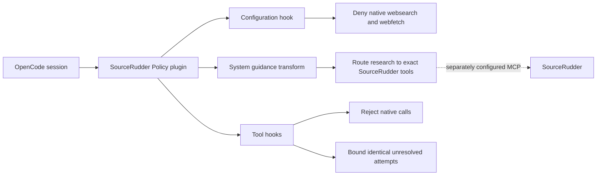

<p align="center">
  
</p>

<p align="center"><strong>Keep OpenCode research on the governed SourceRudder path without replacing host configuration.</strong></p>

[English](README.md) | [Español](README.es.md)

<p align="center">
  <a href="https://github.com/mdesantis1984/SourceRudder-OpenCode-Policy/actions/workflows/ci.yml"></a>
  
  
  
  <a href="LICENSE"></a>
</p>

<p align="center">
  <a href="#quick-start">Install the policy</a> ·
  <a href="#policy-boundary">Inspect the boundary</a> ·
  <a href="#runtime-flow">See the runtime flow</a> ·
  <a href="RUNBOOK.md">Operate and roll back</a> ·
  <a href="SECURITY.md">Report securely</a>
</p>

SourceRudder Policy is an upgrade-safe OpenCode plugin that requires SourceRudder-first research
while strictly blocking OpenCode's native `websearch` and `webfetch` tools.
It is for OpenCode operators who need a small, auditable local policy boundary.

> **Status:** implemented and locally verifiable. This companion project is not a fork,
> release, or publication of SourceRudder. Public visibility is approved
> and tracked by [issue #4](https://github.com/mdesantis1984/SourceRudder-OpenCode-Policy/issues/4), pending its publication gate.
> The CI badge targets `main` and becomes anonymous public evidence only after that gate completes.

## Why this policy

| What operators need | What this companion provides |
| --- | --- |
| A predictable research route | SourceRudder-first guidance names the exact tool for each supported evidence source. |
| A hard native-tool boundary | Merged permissions deny `websearch` and `webfetch`; the before hook rejects direct calls too. |
| Safe coexistence with OpenCode | Unrelated permissions and host system text survive policy installation and refresh. |
| Reviewable behavior | A small TypeScript surface, an exact tracked tool-name set, bounded attempt state, and Node tests expose the contract. |

## Relationship to SourceRudder

This plugin complements the public [SourceRudder MCP research gateway](https://github.com/mdesantis1984/SourceRudder).
It does not bundle, configure, publish, or operate that upstream project. It only
adds local OpenCode policy guidance and runtime checks around native research
tools.

<a id="runtime-flow"></a>

## How it works



The plugin governs OpenCode in memory. It does not proxy research, start
SourceRudder, or change the separately configured MCP connection.

<a id="quick-start"></a>

## Quick start

1. The plugin runtime declares Node.js 20 or later. Local development and CI need
   a Node version accepted by the locked development dependency graph; CI uses
   Node.js 24. Node.js 20 is not currently tested.
2. Install the locked dependencies and run the full local check:

   ```sh
   npm ci --ignore-scripts
   npm run check
   npm run check:docs
   ```

3. Build the versioned plugin bundle:

   ```sh
   npm run build
   ```

4. Copy `dist/sourcerudder-policy-v1.0.0.js` to the root of your OpenCode plugin
   directory, then restart OpenCode. See the [runbook](RUNBOOK.md) for the
   complete, reversible procedure.

The expected local success signal is a passing Node test run and a loadable
`dist/index.js` package entry.

<a id="policy-boundary"></a>

## What the policy enforces

| Area                      | Behavior                                                                                                                                |
| ------------------------- | --------------------------------------------------------------------------------------------------------------------------------------- |
| Native research tools     | `websearch` and `webfetch` are set to `deny` in merged configuration and rejected at the tool boundary.                                 |
| SourceRudder tools        | Nine exact SourceRudder tool names are recognized for bounded unresolved-attempt tracking.                                              |
| Repeated unresolved calls | Eleven identical attempts are permitted per session; the twelfth is blocked. A successful `tool.execute.after` clears that fingerprint. |
| System guidance           | A sentinel makes policy injection idempotent and removes only complete plugin-owned legacy blocks.                                      |
| Existing configuration    | Unrelated permissions and host system text are preserved.                                                                               |

## Boundaries and limitations

- There is no approval path or fallback path for native `websearch` or `webfetch`.
- The policy does not block Bash, other MCP tools, or provider-side actions outside
  OpenCode hooks. It does not claim network exclusivity.
- A missing `tool.execute.after` hook is unresolved, not a confirmed SourceRudder
  failure; the OpenCode SDK does not provide a documented synchronous failed-MCP
  signal for the plugin to classify.
- The plugin targets `@opencode-ai/plugin` `1.18.26` and changes only in-memory
  merged configuration.

## Choose your path

- **Operate it:** follow the [runbook](RUNBOOK.md) for installation, success signals, and rollback.
- **Review the boundary:** inspect [architecture](docs/architecture.md) and [configuration](docs/configuration.md).
- **Contribute safely:** use the [contributing guide](CONTRIBUTING.md) and approved-issue workflow.
- **Audit publication:** read the [repository policy](docs/repository-policy.md) and [security policy](SECURITY.md).

## Documentation

- [Runbook](RUNBOOK.md): build, installation, verification, and rollback.
- [Contributing guide](CONTRIBUTING.md): local development and review expectations.
- [Code of Conduct](CODE_OF_CONDUCT.md): collaboration and private reporting boundaries.
- [Acknowledgements](ACKNOWLEDGEMENTS.md): verified project and community credits.
- [Security policy](SECURITY.md): vulnerability reporting guidance in English.
- [Política de seguridad](SECURITY.es.md): guía de notificación de vulnerabilidades en español.
- [Repository policy](docs/repository-policy.md): intended workflow and GitHub
  administration boundaries.
- [SourceRudder profile matrix](docs/profile-matrix.md): adopted, adapted,
  deferred, prohibited, and non-applicable artifact families.
- [Architecture](docs/architecture.md): plugin boundaries and runtime flow.
- [Configuration](docs/configuration.md): owned configuration changes and limits.
- [Operations](docs/operations.md): local verification and operational signals.
- [Development](docs/development.md): supported local workflow and CI baseline.
- [Release and rollback](docs/release-and-rollback.md): manual operator procedure
  and publication boundaries.
- [Brand system](docs/brand.md): deterministic companion identity assets and provenance.

## Development

The project uses TypeScript, esbuild, and Node's built-in test runner. No external
test framework is required.

```sh
npm run typecheck
npm test
npm run check:package
npm run check:docs
```

## License

SourceRudder Policy is available under the [MIT License](LICENSE).
